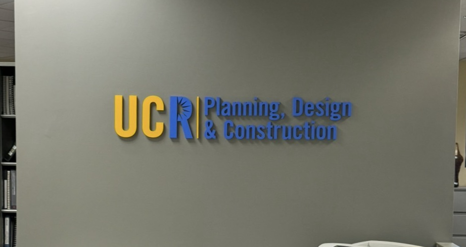
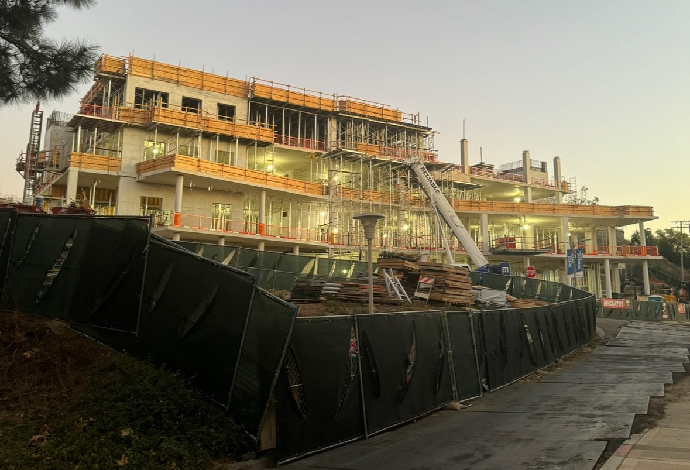
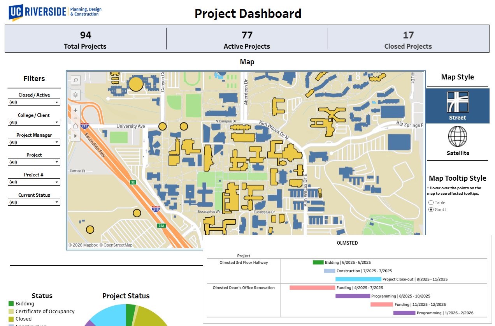

# UCR-Planning-Design-and-Construction-Capital-Projects-Dashboard

## 
 Project Background 

The UCR Campus Architect/Associate Vice Chancellor contracted our department to improve the UCR Planning, Design, and Construction (PD&C) department's multi-million-dollar capital project schedule. As the department’s Business Systems Analyst, I spearheaded the development of a new capital project schedule to mitigate and replace the deficiencies of the legacy Excel schedule.

### Business Problem

* Static Excel spreadsheets exported as flat PDFs produce outdated, hard-to-read reports, limiting interpretation and leaving stakeholders and leadership with more questions than answers.
* Legacy procedures produced unstandardized, siloed, snapshot reports, limiting historical analysis and monitoring, and fragmenting the AVC’s decision-making regarding stakeholders and the department’s portfolio.

### Objective 

* Modernize monthly capital projects delivery by developing a capital projects Tableau dashboard with a modern UI, dynamic filters, and versatile visualizations to improve client interaction, trust, and transparency for better self-service.
* Centralize capital project scheduling by migrating legacy system to a PPM-style configured Smartsheet, increasing portfolio visibility through historical data points for AVC monitoring and decision making.
* Optimize project data update efficiency and Tableau capabilities by engineering back-end data transformations in Smartsheet, enabling better reporting capabilities while maintaining a lean operational update workflow.

### Actions / Tools

* Architected a parent-child schema with back-end data transformation in Smartsheet to join building IDs with spatial data, create timestamps for Gantt, and union archived and active project data. 
* Configured workflow automations and forms to reduce input redundancy, utilizing data-mesh lookups to enforce consistency and standardization across project inputs. 
* Built a Tableau Public dashboard featuring project status distribution, visual timelines, and geospatial mapping, enabling stakeholders to dynamically explore project metrics and timelines.

### Business Impact

* Elevated reporting reliability and stakeholder transparency through an interactive BI PPM for streamlined project tracking and visual interactivity.
* Improved portfolio management and executive visibility for campus leadership by centralizing historical and accountability data structures between project managers and university clients through a standardized dashboard reporting.

## 
 Dashboard 

[UCR PDC Website Dashboard Link](https://pdc.ucr.edu/project-dashboard) 

 
